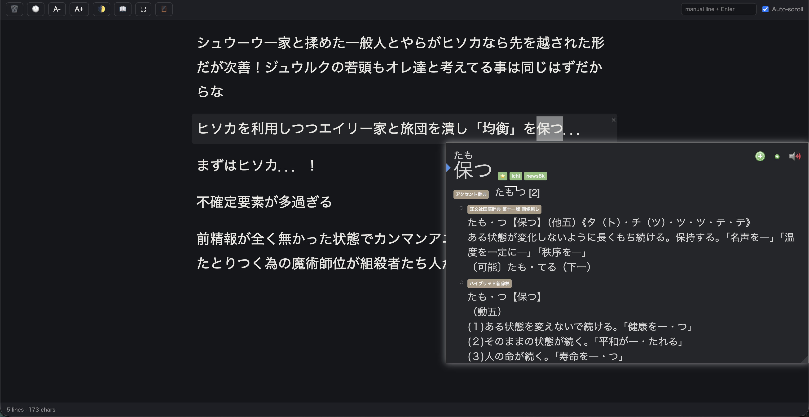

# tsukami-texthooker (掴み)

A minimal, single-file texthooker for reading Japanese text (manga, VNs, games) captured via a clipboard-watching OCR/hook tool.

## Setup

1. Download `texthooker.html` (or clone this repo).
2. Open it in a Chromium-based browser (Chrome or Edge) — double-click the file, or drag it into a tab.
3. Install a clipboard-watching extension, e.g. **Clipboard Inserter Redux**, and enable it for this page. It should append clipboard text as a bare `
` tag to the page — that's what this page watches for.
   - If you're opening `texthooker.html` directly from disk (`file://...`), Chrome extensions can't inject into local files by default. Go to `chrome://extensions`, open the extension's details, and turn on **"Allow access to file URLs"** — then reload the tab.
   - Alternatively, skip the file:// permission entirely by serving the folder locally (e.g. `python3 -m http.server` from the folder, then open `http://localhost:8000/texthooker.html`) and enabling the extension there instead.
4. Point your text-hook / OCR tool (Textractor, manga-ocr, etc.) so its output goes to your OS clipboard.
5. Read — every new clipboard entry appears as a new line automatically.

## Features

- 🗑️ Clear all lines
- 🕒 Toggle timestamps
- A-/A+ Adjust font size
- 🌓 Light/dark theme
- 📖 Focus mode — hides the toolbar and footer for distraction-free reading (press `Esc`, or click the faint ✕ in the top-right corner, to exit)
- ⛶ Browser fullscreen
- 🪟 Floating window — pops the log out into an always-on-top window (Chrome/Edge 116+, via the Document Picture-in-Picture API) that stays visible even over other full-screen apps
- Manual line entry (type into the box + Enter) for notes
- Auto-scroll, with a "↓ new lines" button when you've scrolled up and don't want to jump

## Example workflow: manga + manga-ocr + Yomitan

1. Run [manga-ocr](https://github.com/kha-white/manga-ocr) in the background. It watches your screen/clipboard, OCRs Japanese text from manga panels, and writes the recognized text to your system clipboard.
2. Open `texthooker.html` and turn on **Clipboard Inserter Redux** for that tab — every new clipboard write from manga-ocr becomes a new line in the log.
3. Install [Yomitan](https://github.com/yomidevs/yomitan) and set up your dictionaries and Anki export template.
4. Hover/scan words directly in the texthooker log with Yomitan — lines are plain selectable text, so scanning and card mining works exactly like on any other webpage.
5. Use 📖 Focus mode or 🪟 Floating window to keep the log visible without cluttering your screen while reading. The floating window is especially handy if your manga viewer runs full-screen: it stays on top of it without triggering a full-screen Space switch (macOS) or losing focus.

## Notes

- All data — captured lines and your preferences — is stored in your browser's `localStorage`, scoped to wherever you opened the file from. Nothing is sent anywhere.
- Floating window mode requires a Chromium-based browser that supports the Document Picture-in-Picture API.
- The clipboard extension polls your system clipboard continuously while switched on for a tab — not just OCR text. If you leave it on and then copy something sensitive elsewhere, it'll get logged here too. Toggle it off when you're done reading.
